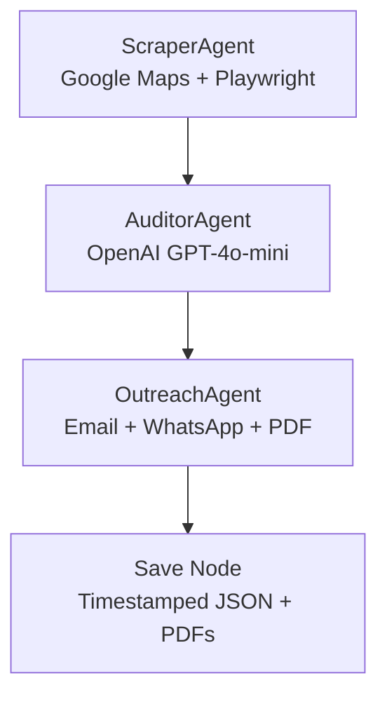

# Autonomous Hyper-Local Client Acquisition Engine

An open-source AI automation system for freelance web developers to acquire local F&B clients automatically. Built specifically for **Cyberjaya, Malaysia** (including Tamarind Square, DPulze Shopping Centre, and surrounding hotspots).

## Architecture



## Core Features

- **Business Scraping:** Discovers F&B businesses via Google Places API, audits websites for SEO/UX, and checks social media presence.
- **AI Audit:** Identifies 3-5 pain points per business (no website, poor SEO, missing menu, no booking, low social media).
- **Strategy Generation:** Produces tailored digital strategy with pricing estimates in MYR.
- **Multi-Channel Outreach:** Generates personalized cold emails, WhatsApp messages, and a professional PDF proposal.
- **State Machine:** LangGraph-inspired sequential pipeline with fallback execution if LangGraph is unavailable.

## Tech Stack

- **Python 3.11+**
- **LangChain / LangGraph** (optional, fallback included)
- **Playwright** — async web scraping
- **OpenAI API** — LLM-powered audit and outreach writing
- **Google Maps API** — business discovery
- **WeasyPrint** — PDF generation
- **Pydantic** — validation and settings
- **TypeScript** (thin orchestration wrapper)

## Installation

```bash
pip install -r requirements.txt
playwright install
```

Copy the environment template and fill in your keys:

```bash
cp .env.example .env
```

Edit `.env`:
```env
OPENAI_API_KEY=sk-...
GOOGLE_MAPS_API_KEY=AIza...
TARGET_REGION=Cyberjaya
TARGET_COUNTRY=Malaysia
```

## Usage

### Full Pipeline
```bash
python -m src.main run --region "Cyberjaya" --keywords cafe restaurant lounge
```

### Scrape Only
```bash
python -m src.main scrape --region "Cyberjaya" --keywords cafe
```

### Audit Existing Data
```bash
python -m src.main audit --input output/raw_businesses_20240115_120000.json
```

## Prompt Customization

All LLM prompts are plain text files in `src/prompts/`:
- `audit_prompt.txt` — Pain-point analysis
- `personalization_prompt.txt` — Opening paragraph
- `proposal_prompt.txt` — Full markdown proposal
- `email_prompt.txt` — Cold email generation
- `whatsapp_prompt.txt` — WhatsApp message

Edit these files to adjust tone, localization, or strategy without touching code.

## Cyberjaya Context

This engine is designed for Malaysian freelancers targeting F&B businesses in:
- **Tamarind Square**
- **DPulze Shopping Centre**
- **Shaftsbury / Shaftsbury Square**
- **Dataran Cyberjaya**

It uses local references, MYR pricing, and Malaysian English conventions.

## License

MIT
